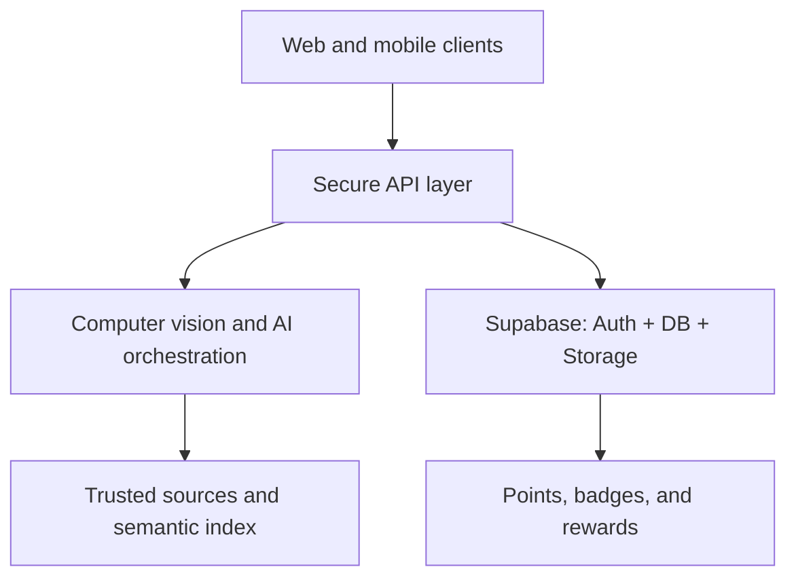

# Saudi Memory AI

An intelligent platform for preserving and exploring the memories of Saudi places through artificial intelligence and responsible community contributions.

Users can capture a landmark or select it on a map, discover its evidence-backed story and community memories, then contribute photos, personal accounts, approximate dates, and sources.

> **Project status:** guided, interactive prototype. Every place, memory, score, and recognition result currently shown in the interface is explicitly illustrative. Production authentication, uploads, place recognition, moderation, and persistent data remain roadmap work.

## The idea in one line

**Capture a place → identify it → experience its story → add your memory → help preserve history.**

## Why Saudi Memory AI?

- Preserve local stories and images before they disappear.
- Connect geographic locations to human memory, not only official information.
- Make Saudi heritage more accessible to younger generations and visitors.
- Use AI for recognition, retrieval, organization, verification, and summarization.
- Reward trustworthy contributions with points, badges, and future partner benefits.

## Core user journey

1. Open the camera, map, or search experience.
2. Identify a place or landmark with a visible confidence score.
3. Explore its story, timeline, images, sources, and community memories.
4. Add a photo, personal account, approximate date, or reference.
5. Pass through automated checks and human/community review when required.
6. Earn points and badges; partner rewards can be enabled after safeguards are complete.

## Main capabilities

| Area | Capability |
| --- | --- |
| Discovery | AI camera, search, map, and nearby stories |
| Artificial intelligence | Place recognition, evidence retrieval, grounded narration, duplicate detection, confidence assessment |
| Community content | Photos, stories, dates, and references |
| Trust | Visible sources, confidence scores, review states, and an audit trail |
| Engagement | Points, badges, regional challenges, and future reward redemption |
| Platforms | Responsive web, followed by iOS and Android using the same accounts and content |

## Target architecture



See [Architecture](docs/ARCHITECTURE.md) and [Data Model](docs/DATA_MODEL.md) for implementation details.

## Run locally

Requirements: Node.js 22 or newer and npm 10 or newer.

```bash
npm ci
cp .env.example .env.local
npm run dev -- --hostname 127.0.0.1
```

Open `http://127.0.0.1:3000`.

Run all quality checks:

```bash
npm run check
```

`npm run check` runs linting, a standalone TypeScript check, repository tests, and a production build. The current prototype does not need Supabase or AI credentials to run; the placeholders in `.env.example` are reserved for later milestones.

GitHub Actions also applies every migration to a fresh local Supabase database, so invalid SQL cannot pass the repository's required checks.

## Repository structure

```text
app/                  Next.js application and API routes
components/           Interactive UI components
lib/                  Types and illustrative data
public/               Brand assets and the PWA manifest
docs/                 Product, architecture, data, roadmap, and demo documentation
supabase/migrations/  Initial database schema and row-level security policies
.github/              CI, Dependabot, issue forms, and pull request templates
```

## Documentation

- [Product vision and MVP scope](docs/PRODUCT.md)
- [Architecture and AI pipeline](docs/ARCHITECTURE.md)
- [Data model and trust](docs/DATA_MODEL.md)
- [Roadmap](docs/ROADMAP.md)
- [Demo script](docs/DEMO_SCRIPT.md)
- [Contributing](CONTRIBUTING.md)
- [Security and privacy](SECURITY.md)

## Project principles

- **People first:** AI supports preservation; it does not replace the people who hold the memories.
- **Sources are visible:** historical claims must be traceable to a source or clearly labeled contribution.
- **Private by default:** sensitive image metadata is removed and publishing controls remain explicit.
- **No confidence theatre:** uncertainty and review status are shown to the user.
- **A complete Saudi perspective:** the vision includes regions, cities, towns, villages, and the diversity of their local accounts.

## Ownership

Saudi Memory AI and its original identity, content, and project materials are owned by the repository owner. Reuse requires written permission unless a license is added later.
