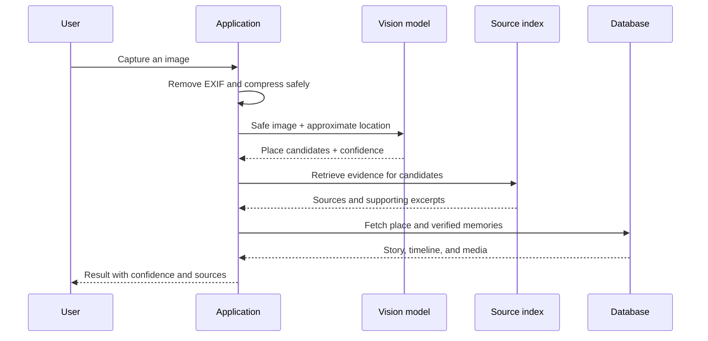

# Technical Architecture

## Current implementation

The repository currently contains a static, interactive Next.js prototype backed by typed illustrative fixtures. It has no live authentication, upload, AI, or Supabase client. The database migration and the remaining sections define the guarded foundation and target architecture for the MVP.

## Components

| Layer | Initial choice | Responsibility |
| --- | --- | --- |
| Web client | Next.js + TypeScript | Discovery, search, contribution, and moderation experiences |
| Mobile client | Expo / React Native | Camera, location, uploads, and notifications |
| Identity and data | Supabase | Auth, PostgreSQL, Storage, and Row Level Security |
| Artificial intelligence | Models behind a server orchestration layer | Image understanding, retrieval, summarization, and verification |
| Semantic retrieval | pgvector in a later milestone | Retrieve relevant sources, places, and memories |
| Observability | Structured logs and tracing | Measure quality and failures without storing sensitive media in logs |

## Place recognition flow

## AI rules

1. The model must not present a historical claim without retrieved evidence.
2. The interface clearly separates **verified information** from **personal accounts**.
3. When confidence falls below the threshold, the product shows candidates or asks the user to confirm.
4. The system does not use facial recognition.
5. Model name, model version, a safe decision summary, and review outcome are retained for auditability.

## Environments

- `local`: illustrative data and local-only credentials.
- `preview`: one isolated preview per pull request with test data.
- `production`: separate credentials, protected branches, backups, and monitoring.

## Security boundaries

- Browsers never receive database service credentials or model-provider secrets.
- Points and redemptions are written through audited, atomic server functions.
- Reviewer access depends on the private `profile_roles` table, never a public profile or client-supplied flag.
- Unreviewed media remains private and is displayed through short-lived signed URLs.
- Browser clients may insert and update only explicitly granted columns; moderation and verification fields remain function-controlled.
- Each contributor uploads only below their own user-ID folder in the private media bucket.
